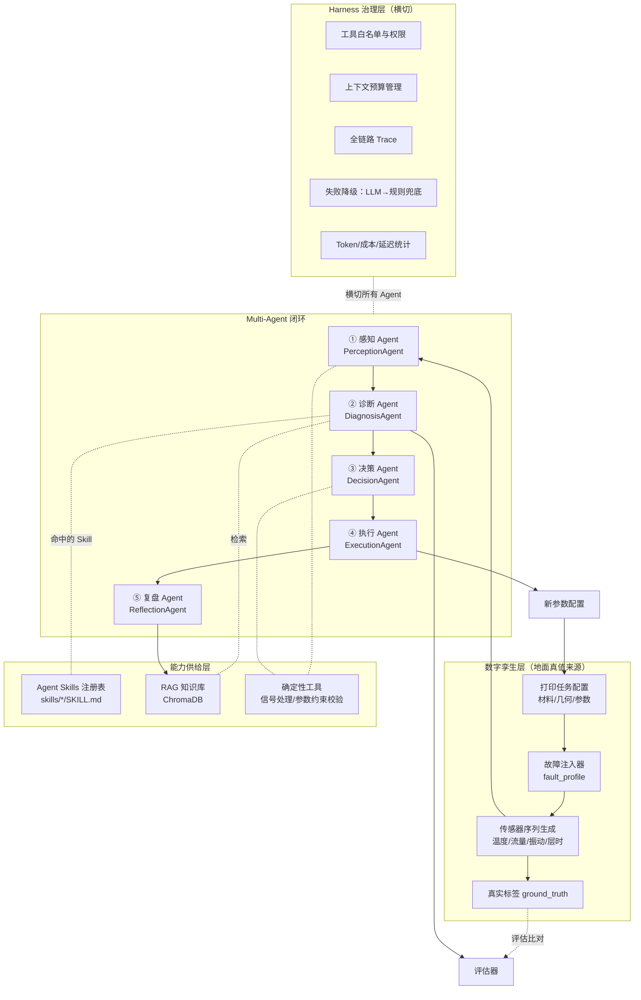
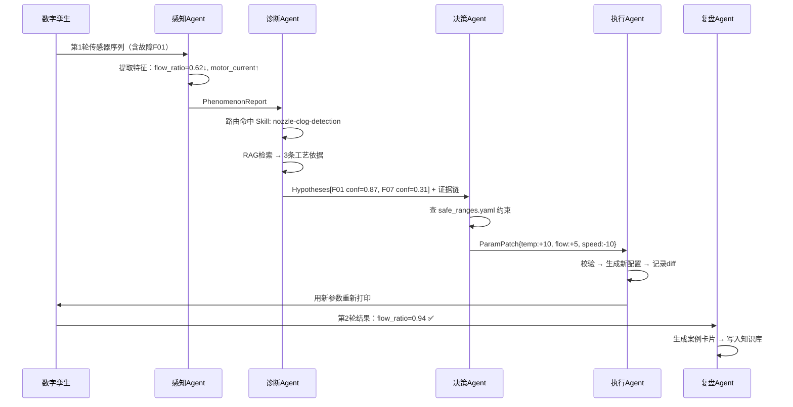

# PrintPilot — 面向 FDM 3D 打印的多智能体排障与参数自优化系统

> 项目规划 v1 · 目标岗位：AI Agent 工程师（实习）· 3D 打印复杂排障与打印质量自动优化方向
>
> 设计原则：**每一个模块都对应 JD 里的一句话**，且每一个模块都有可量化的产出数字。

---

## 零、先看结论：JD 逐条命中表

面试前把这张表背下来，被问到任何一条都能立刻指到具体文件。

| JD 原文要求 | 本项目对应模块 | 具体交付物 | 可量化产出 |
|---|---|---|---|
| 协助开发 Multi-Agent 工作流模块 | `src/agents/` 五个 Agent + `orchestrator.py` | 感知/诊断/决策/执行/复盘 五角色 | 端到端闭环成功率 |
| 参与"感知—诊断—决策—执行"闭环系统 | `src/loop/closed_loop.py` + 数字孪生 | 参数补丁自动回写 → 重打印 → 验证 | 缺陷复发率下降 % |
| 负责模块单元测试与线上问题排查 | `tests/` + `src/harness/trace.py` | pytest 覆盖 + 全链路 trace 回放 | 单测覆盖率、可回放故障案例数 |
| 将排障知识封装为标准化可复用 Agent Skills | `skills/*/SKILL.md` | 6 个 Skill（堵塞/翘曲/拉丝/层错位/首层/参数补偿） | Skill 数量 + 复用次数 |
| **参与 Skills 注册机制的工程化建设** | `src/skills_runtime/registry.py` | 扫描 → 校验 → 索引 → 路由 → CLI | 注册校验规则条数、路由准确率 |
| 参与核心 Agent 提示词设计与迭代优化实验 | `prompts/` 版本化目录 | v1→v5 提示词演进 + 变更记录 | 每版准确率对比曲线 |
| 建立提示词版本管理与自动评估流程 | `src/eval/runner.py` + `evals/goldenset.jsonl` | 黄金评测集 + 一键回归 + CI 门禁 | 评测集规模、回归耗时 |
| **探索 TDAD 等提示词自优化方法论** | `src/eval/tdad_optimizer.py` | 失败案例 → 自动改写提示词 → 重测 | 自优化前后提升 % |
| 整理故障案例、传感器数据及工艺知识 | `data/` + `knowledge/` | 结构化故障卡片 + 传感器数据集 | 案例条数、字段数 |
| 参与 RAG 知识库构建、清洗与评估 | `src/rag/` | 切分策略 + 去重清洗 + 检索评测 | Hit@3 / MRR |
| 跟踪前沿论文与开源项目，输出调研报告 | `docs/research/` | 3 篇技术调研 + 选型结论 | 报告篇数 |
| Harness Engineering 工程化治理体系 | `src/harness/` | 工具白名单/上下文预算/降级/成本统计 | Token 成本下降 %、降级成功率 |
| 熟悉 Python、代码规范 | 全项目 | ruff + mypy + pre-commit | Lint 零告警 |
| 向量数据库（FAISS/ChromaDB/Milvus） | `src/rag/vector_store.py` | ChromaDB 主 + FAISS 可切换 | 双后端抽象 |
| 对 3D 打印/工业制造有背景知识 | `docs/domain/fdm_faults.md` | 工艺机理笔记 | — |
| AI Coding 工具使用经验 | `docs/ai_coding_log.md` | 用 Claude Code 开发本项目的记录 | — |
| 开源贡献 / GitHub 活跃 | 本仓库本身 | 完整 README + Demo GIF + CI 徽章 | Commit 数、Star |

**没有覆盖的 JD 项**：无。这是刻意设计的。

---

## 一、项目定位与边界

### 1.1 一句话定位

> **一个能自己发现打印出了什么问题、自己推理为什么、自己改参数、并且能证明自己改对了的 3D 打印智能体系统。**

### 1.2 面试要敢讲的核心思想

> 物理规律和阈值判断是**确定性、可复现、便宜**的，交给 Python；
> 根因推理、多因素权衡、知识调用是**开放的**，交给 LLM；
> 而领域知识不写在提示词里，写成 **Skill 文件**——因为提示词会膨胀，Skill 可以按需加载。
>
> Agent 的价值不在"会说"，在**能闭环并且能被度量**。所以这个项目最重要的不是 Agent，是那套**评估集 + 故障注入**——它让"我的诊断准确率从 61% 提到 89%"这句话可以被验证。

### 1.3 项目边界（必须写进 README，这是加分不是减分）

| 做 | 不做 |
|---|---|
| 数字孪生仿真器生成传感器数据与缺陷标签 | ❌ 不接真实打印机硬件 |
| 调用现成 LLM API | ❌ 不训练/微调大模型 |
| 离线批处理 + 单次闭环验证 | ❌ 不做毫秒级实时控制 |
| 基于公开工艺知识整理的知识卡片 | ❌ 不爬取、不再分发受版权保护的整篇文档 |
| 单机运行，本地向量库 | ❌ 不做分布式/K8s 部署 |

> ⚠️ **诚实性提示**：仿真器一定要在 README 第一屏明确说明"打印机为仿真、数据为合成"。面试官最反感的是把合成数据说成真实产线数据；主动说清楚反而会被认为工程素养好。如果后续能拿到公开的 FDM 缺陷数据集（如 CAXTON 类图像数据集），作为 `data/real/` 的可选适配层接入即可——**接入前请自行核实数据集许可证**。

---

## 二、系统架构

### 2.1 总体架构



### 2.2 五个 Agent 的职责边界（面试高频追问：为什么要拆成 5 个？）

| Agent | 输入 | 输出 | 是否调用 LLM | 拆分理由 |
|---|---|---|---|---|
| ① 感知 Perception | 原始传感器序列 + G-code 元信息 | 结构化"现象特征"JSON | 否（纯 Python） | 确定性任务不该烧 token，也不该有幻觉 |
| ② 诊断 Diagnosis | 现象特征 | 根因假设列表 + 置信度 + 证据链 | 是（核心） | 开放式推理，需要 RAG + Skills |
| ③ 决策 Decision | 根因假设 | 参数补丁 `ParamPatch` + 风险评估 | 是（受约束） | 需要在物理安全区间内权衡多目标 |
| ④ 执行 Execution | 参数补丁 | 新配置文件 + 变更 diff | 否（纯 Python） | 写操作必须确定性、可回滚、可审计 |
| ⑤ 复盘 Reflection | 本轮全过程 + 结果 | 案例卡片 → 回灌知识库 | 是 | 让系统越用越准，这是"闭环"的最后一环 |

> **拆分的真正理由（这句话要背）**：不是为了"多 Agent 显得高级"，而是为了让**每个环节可以被单独评估和单独替换**。诊断错了我能定位到是感知特征提错了还是推理错了——单体 Agent 做不到这件事。

---

## 三、目录结构

```text
printpilot/
├── README.md                      # 含架构图、Demo GIF、边界声明
├── pyproject.toml                 # ruff + mypy 配置
├── .pre-commit-config.yaml
├── .env.example
├── Makefile                       # make eval / make demo / make skills-check
│
├── simulator/                     # 【地基】数字孪生
│   ├── printer_model.py           # 物理近似模型
│   ├── fault_injector.py          # 故障注入：8 类缺陷
│   ├── sensor_stream.py           # 传感器序列生成（含噪声）
│   └── scenarios/                 # YAML 场景定义
│       ├── clog_gradual.yaml
│       ├── warping_abs_cold_bed.yaml
│       └── multi_fault_combo.yaml
│
├── src/
│   ├── agents/
│   │   ├── base.py                # Agent 抽象基类：run() / 输入输出 schema
│   │   ├── perception.py
│   │   ├── diagnosis.py
│   │   ├── decision.py
│   │   ├── execution.py
│   │   └── reflection.py
│   ├── loop/
│   │   ├── orchestrator.py        # 编排：串行 + 条件分支 + 重试
│   │   └── closed_loop.py         # 打印→诊断→改参→重打印→验证
│   ├── skills_runtime/            # 【加分核心】Skills 注册机制
│   │   ├── schema.py              # SKILL.md frontmatter 数据模型
│   │   ├── loader.py              # 扫描 + 解析 + 校验
│   │   ├── registry.py            # 注册表 + 路由选择
│   │   └── cli.py                 # printpilot skills list/validate/route
│   ├── rag/
│   │   ├── ingest.py              # 加载 + 切分
│   │   ├── clean.py               # 去重 / 归一化 / 质量过滤
│   │   ├── vector_store.py        # ChromaDB / FAISS 双后端抽象
│   │   └── retriever.py           # 检索 + 重排 + 引用回溯
│   ├── harness/                   # 【加分核心】工程化治理
│   │   ├── tool_registry.py       # 工具白名单与权限
│   │   ├── context_budget.py      # 上下文预算与裁剪
│   │   ├── trace.py               # 全链路结构化 trace
│   │   ├── fallback.py            # LLM 不可用 → 规则兜底
│   │   └── cost.py                # token / 延迟 / 费用统计
│   ├── eval/
│   │   ├── runner.py              # 评测执行器
│   │   ├── metrics.py             # Top-1/Top-3 准确率、Hit@k、MRR
│   │   ├── tdad_optimizer.py      # 【加分核心】提示词自优化
│   │   └── report.py              # 生成对比报告 Markdown
│   └── llm/
│       ├── client.py              # 统一 LLM 接口（超时/重试/温度）
│       └── structured.py          # 结构化输出解析与校验
│
├── skills/                        # 【加分核心】领域知识资产
│   ├── nozzle-clog-detection/
│   │   ├── SKILL.md
│   │   └── scripts/flow_deviation.py
│   ├── warping-root-cause/
│   │   ├── SKILL.md
│   │   └── references/adhesion_matrix.md
│   ├── stringing-diagnosis/SKILL.md
│   ├── layer-shift-diagnosis/SKILL.md
│   ├── first-layer-adhesion/SKILL.md
│   └── param-compensation/
│       ├── SKILL.md
│       └── references/safe_ranges.yaml
│
├── prompts/                       # 提示词版本管理
│   ├── diagnosis/
│   │   ├── v1_baseline.md
│   │   ├── v2_add_evidence_chain.md
│   │   ├── v3_few_shot.md
│   │   ├── v4_tdad_auto.md        # 自优化产出
│   │   └── CHANGELOG.md           # 每版改了什么、指标变化多少
│   └── decision/...
│
├── knowledge/                     # RAG 语料（自己整理的知识卡片）
│   ├── faults/                    # 每个缺陷一张卡片
│   ├── materials/                 # PLA/ABS/PETG/TPU 工艺窗口
│   └── params/                    # 参数机理说明
│
├── evals/
│   ├── goldenset.jsonl            # 黄金评测集（含 ground truth）
│   ├── retrieval_qa.jsonl         # 检索专项评测集
│   └── results/                   # 历次评测结果快照
│
├── data/
│   ├── synthetic/                 # 仿真生成的传感器数据
│   └── cases/                     # 故障案例库
│
├── tests/
│   ├── test_perception.py
│   ├── test_skills_registry.py
│   ├── test_param_constraints.py
│   └── test_fallback.py
│
├── docs/
│   ├── domain/fdm_faults.md       # 工艺机理笔记
│   ├── research/                  # 技术调研报告
│   │   ├── 01_agent_skills_vs_tools_vs_rag.md
│   │   ├── 02_prompt_auto_optimization.md
│   │   └── 03_multi_agent_orchestration.md
│   ├── ai_coding_log.md
│   └── decisions/                 # ADR 架构决策记录
│
└── app.py                         # Streamlit 演示界面
```

---

## 四、六个核心设计（逐个展开）

### 4.1 数字孪生仿真器 —— 整个项目的地基

**为什么它最重要**：没有它，你就没有 ground truth；没有 ground truth，你就说不出任何准确率数字；说不出数字，这个项目就和"我调了个 API"没区别。

**故障注入设计**（8 类，覆盖 JD 点名的堵塞和翘曲）：

| 故障码 | 缺陷 | 注入方式 | 传感器可观测信号 |
|---|---|---|---|
| F01 | 喷嘴渐进堵塞 | 流量系数随时间衰减 | 实际挤出量/期望挤出量比值持续 < 0.85；挤出电机电流上升；加热棒占空比异常 |
| F02 | 喷嘴完全堵塞 | 流量骤降至 0 | 流量比 → 0；层时间正常但材料消耗停滞 |
| F03 | 翘曲 | 热床温度不足 + 环境温度低 + 大底面积 | 床温均值低于材料窗口；首层后风扇提前开启；底面积/周长比高 |
| F04 | 拉丝 | 回抽不足 + 温度过高 | 空驶段数量多；喷头温度高于材料窗口上限 |
| F05 | 层错位 | 加速度超限 / 皮带松 | 加速度计尖峰；实际位置与指令位置偏差累积 |
| F06 | 首层不粘 | Z offset 偏大 | 首层挤出压力低；Z 探针基准偏移 |
| F07 | 欠挤出 | flow% 偏低 / 材料受潮 | 流量比 0.85~0.95 且波动；湿度传感器高 |
| F08 | 层间结合弱 | 温度偏低 + 风扇过强 | 喷头温度低于窗口；风扇 PWM 高 |

**关键实现要点**：
- 每条传感器序列叠加高斯噪声，**并且要有一部分"正常但看起来可疑"的样本**（假阳性陷阱），否则评估集太简单，准确率虚高。
- 支持**多故障并发**（如 F01+F07 同时发生），这是"复杂排障"的体现，也是区分度最高的评测子集。
- 场景用 YAML 定义，一条命令批量生成数据集。

```python
# simulator/scenarios/clog_gradual.yaml 示例
name: clog_gradual
material: PLA
geometry: {base_area_mm2: 2400, perimeter_mm: 220, height_mm: 40}
params: {nozzle_temp: 205, bed_temp: 60, flow: 100, retract_mm: 5.0, speed_mm_s: 60}
faults:
  - code: F01
    onset_layer: 25
    severity: 0.6      # 流量衰减到 60%
noise: {sensor_sigma: 0.03, dropout_rate: 0.01}
ground_truth:
  root_causes: ["F01"]
  expected_patch: {nozzle_temp: "+10", flow: "+5", speed_mm_s: "-10"}
```

---

### 4.2 Multi-Agent 闭环

**闭环的完整定义**（这是 JD 原话"感知—诊断—决策—执行"的落地）：



**工程细节（面试会问）**：
- **Agent 间通信用严格 schema**（Pydantic），不用自然语言传递。理由：自然语言传递会累积信息损耗，且无法单元测试。
- **诊断输出必须带证据链**：每个假设关联"哪个传感器特征 + 哪条知识来源"，不允许无依据断言。这是幻觉治理的关键手段。
- **决策必须过硬约束**：`param_constraints.py` 里写死物理安全区间（如 PLA 喷头温度 190–230℃），LLM 给出的越界值直接拒绝并要求重试，重试 2 次仍失败则降级到规则表。
- **执行是纯代码**：LLM 永远不直接写文件。它只输出结构化补丁，由确定性代码应用。**这条要在面试时主动强调，是安全意识的体现。**

---

### 4.3 Agent Skills 封装与注册机制 —— 最大差异化加分项

JD 里"Agent Skills 模块化能力工程""参与 Skills 注册机制的工程化建设"是最具体、也最少有候选人真做过的一条。这块做扎实，面试基本稳。

#### SKILL.md 标准格式

```markdown
---
name: nozzle-clog-detection
description: 当传感器显示挤出流量比持续低于期望值、挤出电机电流异常升高、
  或打印中途出现材料消耗停滞时，用本技能判定喷嘴堵塞类型（渐进/完全/热端堵塞）
  并给出分级证据。适用于 FDM 打印中的欠挤出与断料类现象诊断。
version: 1.2.0
domain: fdm/extrusion
inputs: [flow_ratio_series, extruder_current, hotend_duty, layer_time_series]
outputs: [clog_type, severity, evidence]
scripts: [scripts/flow_deviation.py]
tags: [clog, under-extrusion, extruder]
---

# 喷嘴堵塞检测

## 判定流程

1. 计算流量偏差序列 `flow_ratio = actual_extruded / commanded_extruded`
   （可直接调用 `scripts/flow_deviation.py`）
2. 按下表分级：

| 现象 | 渐进堵塞 | 完全堵塞 | 热端堵塞(heat creep) |
|---|---|---|---|
| flow_ratio 走势 | 缓慢下滑至 0.6~0.85 | 骤降至 <0.1 | 打印中后期突然恶化 |
| 挤出电机电流 | 持续升高 | 尖峰后回落 | 升高 |
| 与打印时长关系 | 弱相关 | 无 | 强相关（长时间打印后出现）|

3. 排除项（必须检查，否则易误判）：
   - flow_ratio 低但电机电流**正常** → 更可能是 flow% 设置偏低（F07），不是堵塞
   - 仅单层异常 → 可能是料盘缠绕，不是堵塞

## 输出格式

返回 JSON：`{"clog_type": "gradual|complete|heat_creep|none",
"severity": 0.0-1.0, "evidence": [{"signal": "...", "value": ..., "threshold": ...}]}`

## 常见误判

- 湿料导致的间歇性欠挤出会伪装成渐进堵塞 → 检查湿度传感器与"气泡音"标记
```

**设计要点（这些细节是内行标志）**：
1. `description` 写**触发条件**而不是功能介绍——因为路由是靠 description 做语义匹配的，写"本技能用于检测堵塞"检索效果远差于写"当出现 XX 现象时"。
2. **渐进式披露**：主 SKILL.md 保持精简，大表格和长参考放 `references/`，确定性计算放 `scripts/`。上下文只在需要时展开。
3. **必须有"排除项/常见误判"章节**——这是把资深工程师的经验固化下来，也是 Skill 相对于 RAG 片段的优势。

#### 注册机制设计（`src/skills_runtime/`）

```python
# registry.py 核心接口设计
class SkillRegistry:
    def scan(self, root: Path) -> list[SkillMeta]:
        """递归扫描 skills/，解析每个 SKILL.md 的 frontmatter"""

    def validate(self, meta: SkillMeta) -> list[ValidationError]:
        """注册前校验：
        R1 name 必须唯一且为 kebab-case
        R2 description 长度 40–500 字，且必须包含触发条件描述
        R3 version 符合 semver
        R4 inputs 字段必须存在于 PhenomenonReport schema 中（防止定义了取不到的输入）
        R5 scripts 引用的文件必须存在且可导入
        R6 domain 必须在允许的枚举内
        R7 与已注册 Skill 的 description 语义相似度 > 0.9 时告警（防重复建设）
        """

    def route(self, phenomenon: PhenomenonReport, top_k: int = 3) -> list[SkillMeta]:
        """两阶段路由：
        阶段1 硬过滤：inputs 字段在本次现象中全部可用的 Skill
        阶段2 语义排序：现象描述 vs description 的 embedding 相似度
        返回 Top-K，只把这 K 个 Skill 的正文注入上下文
        """
```

**CLI 工具**（这个做出来，演示时非常有说服力）：

```bash
printpilot skills list              # 表格列出所有已注册 Skill
printpilot skills validate          # CI 里跑，任一 Skill 不合规则构建失败
printpilot skills route --case F01  # 给定案例，看路由命中了哪几个 Skill 及分数
```

> **面试必答题：Skills、Tools、RAG 三者区别？**
> - **Tool** = 能力（能做什么动作，如"读取传感器"），确定性，有副作用
> - **RAG** = 事实（是什么，如"PLA 熔点 190–220℃"），碎片化，按查询召回
> - **Skill** = 方法论（怎么做，如"判断堵塞要先看流量再看电流，还要排除湿料"），有结构、有流程、可版本化
>
> 一句话：**RAG 给你知识点，Skill 给你解题步骤，Tool 给你动手能力。** 这三句能说清楚，面试官就知道你真做过。

---

### 4.4 RAG 知识库：构建 / 清洗 / 评估

JD 原文是"构建、**清洗**与**评估**"——大多数人只做构建，清洗和评估是分水岭。

**语料来源（版权安全的做法）**：
- 自己整理的**故障知识卡片**：每张卡片固定字段（现象 / 机理 / 影响参数 / 处置 / 副作用 / 验证方法），内容基于公开工艺知识用自己的话写。**不要整篇复制他人文档**。
- 仿真产生的**历史案例卡片**（复盘 Agent 自动生成，实现"越用越准"）。
- 材料工艺窗口表（自建 YAML → 渲染为文本）。

**切分策略**（要做对比实验，这是报告素材）：

| 策略 | 说明 | 适用性 |
|---|---|---|
| 固定窗口 512/overlap 64 | 基线 | 差，会切断表格 |
| 按 Markdown 标题层级切 | 每个二级标题一块 | 好，结构化语料首选 |
| **按语义单元切（推荐）** | 一张故障卡片 = 一个 chunk，不再切 | 最好，知识完整性最高 |

**清洗流水线**（`clean.py`，每步都要有前后数量对比）：
1. 归一化：单位统一（℃/mm/s）、参数别名归并（`nozzle_temp` / `hotend_temp` / `喷头温度` → 统一键）
2. 去重：MinHash 近似去重，阈值 0.85
3. 质量过滤：过短（<80 字）、无实质结论、纯目录页剔除
4. 元数据注入：`{fault_code, material, param_affected, source, confidence}` —— **这一步是检索质量的关键**，支持"先按 material 过滤再语义检索"的混合检索

**检索评估**（`evals/retrieval_qa.jsonl`）：
- 构造 60–100 条 query，每条标注**应当被召回的 chunk id**
- 指标：**Hit@1 / Hit@3 / Hit@5 / MRR**
- 对比实验矩阵（这张表直接进简历）：

| 配置 | Hit@3 | MRR |
|---|---|---|
| 固定窗口切分 + 纯向量 | 基线 | 基线 |
| 语义切分 + 纯向量 | ? | ? |
| 语义切分 + 元数据过滤 | ? | ? |
| 语义切分 + 元数据过滤 + BM25 混合 | ? | ? |

> 空着的问号就是你要跑出来的数字。**能报出这四行数字，你就赢过 90% 的候选人。**

---

### 4.5 提示词工程：版本管理 + 自动评估 + TDAD

#### 版本管理约定

- 提示词是**文件**不是字符串常量，路径即版本：`prompts/diagnosis/v3_few_shot.md`
- 每个提示词文件头部带 frontmatter：`{version, created, parent, hypothesis, result}`
- `CHANGELOG.md` 强制记录：**改了什么 → 假设是什么 → 实测指标变化多少 → 保留还是回滚**

```markdown
## v3_few_shot (parent: v2)
- 改动：在 system 中加入 3 个 few-shot 案例，覆盖 F01/F03/多故障
- 假设：多故障场景 Top-1 准确率偏低是因为模型没见过组合模式
- 实测：整体 Top-1 74.2% → 81.5%；多故障子集 48% → 69%；单故障子集 -1.2%（可接受）
- 结论：保留。副作用是 prompt token +820，成本每次 +0.0031 美元
```

> 这段 CHANGELOG 的写法本身就是能力证明——**有假设、有实验、有副作用评估、有结论**，这是工程师而不是调参侠的思维。

#### TDAD 自优化循环

> ⚠️ **说明**：JD 中的 "TDAD" 未给出全称。我按业界最合理的解读实现为 **Test-Driven Agent Development（测试驱动的 Agent 开发）**——即先写评测用例，再让失败用例驱动提示词迭代。**建议你在面试中主动说明这个解读，并问对方团队内部的具体定义**——这既显示你思考过，也避免答错。核心闭环无论叫什么名字都是通用的。

```python
# src/eval/tdad_optimizer.py 核心循环
def tdad_loop(prompt_v: Prompt, goldenset: list[Case], max_rounds=5) -> Prompt:
    for round_i in range(max_rounds):
        # 1. RED：跑评测，收集失败案例
        results = run_eval(prompt_v, goldenset)
        failures = [r for r in results if not r.passed]
        if results.accuracy >= TARGET:
            break

        # 2. ANALYZE：让"优化器 Agent"分析失败模式（而不是逐条打补丁）
        #    关键：喂给它 失败案例 + 当前提示词 + 正确答案，要求它归纳"共性失效模式"
        failure_patterns = optimizer_llm.analyze(failures, prompt_v)

        # 3. GREEN：生成候选提示词（一次生成 3 个变体，而非 1 个）
        candidates = optimizer_llm.rewrite(prompt_v, failure_patterns, n=3)

        # 4. VERIFY：在【留出集】上验证，防止过拟合评测集
        best = max(candidates, key=lambda c: run_eval(c, holdout_set).accuracy)

        # 5. 只有在留出集上也提升才接受（关键防过拟合门禁）
        if run_eval(best, holdout_set).accuracy > run_eval(prompt_v, holdout_set).accuracy:
            prompt_v = best
            save_version(best, round_i)
        else:
            break
    return prompt_v
```

**必须做的三件事**（否则会被问倒）：
1. **评测集切分**：goldenset（优化用）/ holdout（验证用）严格分开，否则就是在评测集上过拟合。
2. **人工兜底**：自动生成的提示词必须经人工 review 才能合并，`prompts/v4_tdad_auto.md` 要标注"自动生成，已人工审核"。
3. **成本记录**：每轮优化消耗多少 token，写进报告。自优化不是免费的。

---

### 4.6 Harness Engineering 治理层

JD 点名"Harness Engineering 工程化治理体系"。这个词很新，做出实体来极加分。落地成五件具体的事：

| 治理能力 | 实现 | 为什么需要（面试答法） |
|---|---|---|
| **工具白名单与权限** | `tool_registry.py`：每个 Agent 声明可用工具集，越权调用直接拒绝 | 诊断 Agent 不应该有写文件权限，最小权限原则 |
| **上下文预算** | `context_budget.py`：每个 Agent 有 token 上限，超限时按优先级裁剪（证据 > 历史 > 背景） | Skill 全量注入会爆上下文，必须按需加载 + 主动裁剪 |
| **全链路 Trace** | `trace.py`：每步记录 `{agent, input, prompt_version, skills_hit, retrieved_ids, output, tokens, latency}`，落 JSONL | 线上问题排查靠这个。**能回放才能排障** |
| **失败降级** | `fallback.py`：LLM 超时/限流/输出不合 schema → 降级到规则决策表，标记 `degraded=true` | 生产系统不能因为 LLM 挂了就整体不可用 |
| **成本可观测** | `cost.py`：按 Agent / 按案例统计 token 与费用，输出成本报表 | 优化前后成本对比是很硬的产出数字 |

> **面试金句**：「我理解的 Harness Engineering，是把 Agent 从 Demo 变成可运维系统的那一层——**权限、上下文、可观测、可降级、可计费**。Agent 本身好写，这一层难写，但没有这一层就不能上线。」

---

## 五、分阶段实施计划

每阶段都有**明确完成标准**和**可演示物**，避免烂尾。总周期约 4 周（每周投入 3 天，与 JD 要求的到岗节奏一致）。

### 阶段 0：环境与骨架（0.5 天）

- Python 3.11 虚拟环境（注意：你机器当前 `python` 指向 WindowsApps 占位符，需要装真实 Python 或用 `py` 启动器）
- `pyproject.toml` + ruff + mypy + pre-commit
- 空目录骨架 + `make` 命令占位

```bash
py -m venv .venv
```

**完成标准**：`py -m pytest` 能跑（哪怕 0 个测试）、`ruff check .` 零告警。

---

### 阶段 1：数字孪生仿真器（3 天）⭐ 地基

- 实现 8 类故障注入 + 传感器序列生成 + 噪声
- 生成数据集：**≥ 400 条**（单故障 250 / 多故障 100 / 正常但可疑 50）
- 每条带完整 ground truth

**完成标准**：一条命令 `make dataset` 生成全量数据；随机抽 10 条人工检查信号形态符合物理直觉；数据集分布统计图能画出来。

**可演示物**：一张传感器曲线图，标注出故障注入点。

---

### 阶段 2：感知 + 诊断 Agent（4 天）

- 感知：纯 Python 特征提取（流量比、电流趋势、温度偏离、加速度尖峰、层时异常）
- 诊断：v1 基线提示词，先不接 RAG 不接 Skills
- 搭 `evals/goldenset.jsonl`（**从阶段1数据集划 150 条，其中 30 条留出**）
- 跑出第一个基线准确率

**完成标准**：`make eval` 输出 Top-1 / Top-3 准确率数字，结果落 `evals/results/`。

> 💡 **这一步的基线数字非常重要**——它是后面所有"提升了 X%"的分母。别跳过。

---

### 阶段 3：RAG 知识库（3 天）

- 写 ≥ 25 张故障知识卡片 + 材料工艺窗口
- 实现 ingest / clean / vector_store（ChromaDB）/ retriever
- 构建 `retrieval_qa.jsonl`（≥ 60 条）
- 跑切分策略对比实验，填满 4.4 那张表

**完成标准**：4 组配置的 Hit@3 / MRR 数字全部跑出；诊断接入 RAG 后重跑 goldenset，得到第二个准确率数字。

---

### 阶段 4：Agent Skills + 注册机制（4 天）⭐ 差异化核心

- 写 6 个 SKILL.md（先写 2 个跑通，再补 4 个）
- 实现 loader / validate（7 条校验规则）/ route（两阶段路由）
- CLI 三个命令
- 接入诊断 Agent，重跑评测

**完成标准**：
- `printpilot skills validate` 在 CI 中运行且能拦住故意写坏的 Skill（要写一个 `tests/fixtures/bad_skill/` 来测）
- 路由准确率：给定案例，正确 Skill 出现在 Top-3 的比例 ≥ 90%
- 得到第三个准确率数字（RAG+Skills）

**可演示物**：`skills route --case F01` 的终端输出截图，显示命中分数。

---

### 阶段 5：决策 + 执行 + 闭环（3 天）

- 参数补丁数据模型 + 安全区间约束校验
- 执行 Agent 写新配置 + diff
- `closed_loop.py`：改参后回仿真器重打印，验证缺陷是否消除
- **闭环有效率**：多少比例的案例在 1 轮改参后缺陷消除

**完成标准**：至少 3 个场景能完整跑通两轮闭环，第二轮指标改善；越界参数被成功拦截（要有单测）。

**可演示物**：闭环前后传感器曲线对比图 —— **这是整个项目最有冲击力的一张图**。

---

### 阶段 6：Harness 治理层 + TDAD（3 天）

- 五个治理模块落地
- TDAD 循环跑 3–5 轮，产出 v4 提示词
- 成本报表、trace 回放

**完成标准**：拔掉 API key 后系统仍能以降级模式跑完（有单测）；TDAD 前后在**留出集**上的对比数字。

---

### 阶段 7：文档、Demo、调研报告（2 天）

- README：架构图 + Demo GIF + 边界声明 + 一键复现指令
- 3 篇调研报告
- Streamlit 演示页
- `docs/ai_coding_log.md`：记录用 Claude Code 开发本项目的实际用法（对应"AI Coding 工具实际使用经验"加分项）

**完成标准**：一个没见过这个项目的人，按 README 能在 10 分钟内跑起来。

---

## 六、最终要拿到的数字（简历直接用）

跑完全流程，你应该能填满这张表：

| 指标 | 基线 | +RAG | +Skills | +TDAD |
|---|---|---|---|---|
| 根因 Top-1 准确率 | __% | __% | __% | __% |
| 根因 Top-3 准确率 | __% | __% | __% | __% |
| 多故障子集 Top-1 | __% | __% | __% | __% |
| 平均 token / 案例 | __ | __ | __ | __ |
| 平均延迟 | __s | __s | __s | __s |

| 其他关键指标 | 数值 |
|---|---|
| 检索 Hit@3 / MRR | __ / __ |
| Skill 路由 Top-3 命中率 | __% |
| 闭环单轮修复有效率 | __% |
| 降级模式可用性 | 100%（有单测保证）|
| 评测集规模 | 150 案例 + 60 检索问答 |
| 单测覆盖率 | __% |

> **重要**：数字不好看不要改数字，要在 README 里诚实写出来并分析原因。**"多故障场景 Top-1 只有 69%，主要失效模式是把 F01+F07 组合误判为单一 F07"——这句话比一个漂亮但可疑的 95% 有说服力得多。**

---

## 七、简历怎么写

放在项目经历第一条，替换掉一个数据分析项目（保留 1–2 个数据分析项目体现数据功底即可）。

```
PrintPilot — 3D打印多智能体排障与参数自优化系统    | Python · Multi-Agent · Agent Skills · RAG · ChromaDB

• 设计并实现"感知—诊断—决策—执行—复盘"五角色 Multi-Agent 闭环：Python 负责确定性特征提取与
  参数约束校验，LLM 仅负责根因推理与权衡，执行环节全部由代码完成以保证可回滚与可审计；
  构建含 8 类故障注入的数字孪生仿真器生成 400+ 带标注案例，使 Agent 效果首次可被量化评估。

• 将喷嘴堵塞检测、翘曲根因推理、参数补偿等排障知识封装为 6 个标准化 Agent Skills，并实现
  Skills 注册机制：frontmatter 解析、7 条注册期校验规则（含语义重复告警）、"输入字段硬过滤 +
  语义排序"两阶段路由与 CLI 工具，接入 CI 门禁；根因诊断 Top-1 准确率由 XX% 提升至 XX%。

• 建立提示词版本管理与自动评估流程（150 案例黄金集 + 30 条留出集），实现 TDAD 测试驱动自优化
  循环（失败模式归纳 → 多候选改写 → 留出集验证防过拟合）；同时构建 RAG 知识库的切分/清洗/
  评估链路（Hit@3 由 XX 提升至 XX），并落地 Harness 治理层：工具白名单、上下文预算、全链路
  Trace、LLM 失效规则降级与成本统计。
```

**写法要点**：
- 每条 bullet 都是「做了什么 + **为什么这么设计** + 量化结果」三段式
- "Python 做确定性、LLM 做开放推理"这个判断出现在第一条第一句，**它比任何技术名词都能体现工程判断力**
- 技能栏补上：`Agent 开发（Multi-Agent 编排 / Agent Skills / Prompt Engineering / RAG / 向量数据库 ChromaDB·FAISS）`

---

## 八、面试问答预演

| 高频问题 | 答法要点 |
|---|---|
| 为什么用 Multi-Agent 而不是一个大 Agent？ | 不是为了炫技，是为了**每个环节能被单独评估和替换**。诊断错了我能定位是特征提错还是推理错，单体做不到。且感知/执行是确定性任务，不该烧 token 也不该有幻觉。 |
| Skills 和 Tools、RAG 有什么区别？ | RAG 给知识点，Skill 给解题步骤，Tool 给动手能力。Skill 的独特价值是能承载"排除项/常见误判"这类**流程性经验**。 |
| 你的 Skill 怎么被选中的？ | 两阶段：先用 inputs 字段做硬过滤（取不到数据的 Skill 直接排除），再对 description 做语义排序取 Top-3。只注入 Top-3 正文，控制上下文。 |
| 怎么防止 LLM 幻觉出一个危险参数？ | 三层：① 提示词要求输出结构化补丁而非直接改配置；② `safe_ranges.yaml` 物理硬约束校验，越界拒绝重试；③ 重试 2 次失败降级规则表。**LLM 永远不直接写文件。** |
| 数据是仿真的，有说服力吗？ | 主动承认并说明这是**刻意选择**：真实产线数据拿不到标签，而没有 ground truth 就无法评估 Agent 效果。仿真让我能做故障注入、多故障组合、假阳性陷阱——这些在真实数据上反而做不到。架构上留了 `data/real/` 适配层，接真实数据只需替换感知层输入。 |
| 提示词优化怎么保证不是运气？ | goldenset 和 holdout 严格分开，只有在**留出集**上也提升才接受；每版记录假设、指标、副作用（token 成本）；有回滚记录。 |
| 你了解 TDAD 吗？ | 诚实说：JD 里没给全称，我按 Test-Driven Agent Development 理解并实现了完整循环——先写评测再让失败驱动迭代。然后**反问对方团队的具体定义**。这比硬编强得多。 |
| 线上出问题怎么排查？ | 全链路 trace 落 JSONL，记录每步的 prompt 版本、命中 Skill、检索 chunk id、输入输出、token、耗时。**能回放才能排障**，这是我做 Harness 层的主要动机。 |
| 你对 3D 打印懂多少？ | 老实说是从工艺文档和机理笔记学的（`docs/domain/`），不是从业者。但我把机理整理成了可被系统使用的结构化知识，而且设计了排除项来处理易混淆现象——**我的价值是把领域专家的知识工程化，不是替代专家。** |
| 这个项目最大的不足？ | 挑一个真的说：比如仿真器的物理模型是简化近似、缺少视觉模态、闭环只验证单轮。**准备好"如果给我两周我会先做什么"的答案。** |

---

## 九、风险与常见坑

| 风险 | 应对 |
|---|---|
| ⚠️ **贪多做不完** | 阶段 1–4 是必做核心（数字孪生 + 诊断 + RAG + Skills）。时间不够就砍阶段 6 的 TDAD，保留治理层的 trace 和降级两项即可。**半成品的完整闭环 > 华丽的半个系统。** |
| ⚠️ 评测集太简单，准确率虚高 | 必须放入多故障组合和"正常但可疑"样本。基线准确率如果一上来就 95%，说明评测集有问题。 |
| ⚠️ Skill 写成了说明书 | description 写**触发条件**不写功能介绍；正文必须有"排除项"章节。 |
| ⚠️ 提示词优化在评测集上过拟合 | 留出集是硬门禁，不许省。 |
| ⚠️ 版权问题 | 知识卡片用自己的话写，注明参考来源但不整篇复制；不要把他人文档打包进仓库。 |
| ⚠️ API key 泄露 | `.env` 进 `.gitignore`，只提交 `.env.example`；提交前跑 `git secrets` 或人工检查。 |
| ⚠️ 环境问题 | 当前机器 `python` 指向 WindowsApps 占位符，`pip` 不可用。先装正式 Python 3.11 或统一用 `py -m`。 |

---

## 十、下一步

建议顺序：

1. **确认技术选型**：LLM 供应商（你上个项目用的 openai 1.x，可沿用）、embedding 模型（中文建议 bge-small-zh-v1.5，可本地跑省钱）
2. **先搭阶段 0 + 阶段 1**，把数字孪生跑出第一张传感器曲线图 —— 这是最能建立信心的一步
3. 每完成一个阶段就 commit + 更新 README 进度，让 GitHub 有连续的 commit 记录（对应加分项「GitHub 活跃记录」）
