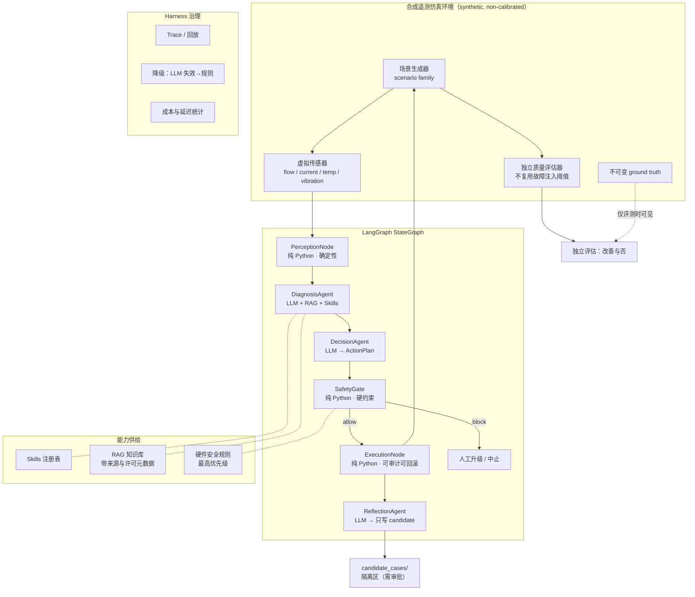

# PrintPilot — FDM 打印过程异常诊断与安全动作决策系统

> 项目规划 **v2**（修订版）· 目标岗位：AI Agent 工程师（实习）
>
> 本版依据 `2026-07-29 PrintPilot 项目审查报告` 全面重写。**v1 的工期计算和堵塞补偿方案存在实质错误，已修正。**
>
> ⚠️ **本文件描述的是目标设计，代码尚未创建。** 所有目录、命令、指标在实现并验证前均为占位。

---

## 修订说明：v2 相对 v1 改了什么

| # | v1 的问题 | v2 的处置 |
|---|---|---|
| 1 | 工期写 4 周，实际累计 22.5 人日（每周 3 天需 7.5 周） | 重做为 **12 人日 MVP**，其余进 Stretch |
| 2 | 只有自研 orchestrator，无 Agent 框架 | 改用 **LangGraph StateGraph** |
| 3 | 声称检测翘曲/拉丝/层间结合弱，但传感器看不见外观缺陷 | 项目收缩为**过程异常与缺陷风险**诊断；新增独立质量评估器 |
| 4 | F01 堵塞的补丁是 `flow +5` — 物理上错误且不安全 | 改为 **ActionPlan 五类动作**，堵塞走维护路径而非参数闭环 |
| 5 | 仿真阈值 = 感知阈值 = 知识卡 = 评测答案，存在数据泄漏 | 按**场景族**切分 train/dev/holdout/challenge + 独立质量函数 |
| 6 | 复盘结果直接回灌知识库 | 改为 **candidate 隔离区 + 审批**后才入库 |
| 7 | 只报 Top-1/Top-3 准确率 | 多标签指标 + 校准度 + **危险动作误放行率** + bootstrap CI |
| 8 | 评测集数字三处互相矛盾（150/180/30） | 统一为 **dev 100 / holdout 30 / challenge 30 = 160** |
| 9 | `src/agents/` 缺顶层包名 | 改为标准 **src layout**：`src/printpilot/` |
| 10 | 复现入口全是 `make`，但目标环境是 Windows | 改为跨平台 CLI，Makefile 降为可选 |
| 11 | Skill 路由要求 inputs 全部存在才保留 | 拆为 `required_inputs` / `optional_inputs` + 缺失策略 |
| 12 | RAG chunk 无来源、无冲突处理 | 补齐来源元数据 + **知识优先级链** |
| 13 | 自称"数字孪生" | 改称**合成遥测仿真环境**（无实机同步、无标定） |
| 14 | 写"没有覆盖的 JD 项：无" | 删除。学历/到岗/开源不可能由项目稿覆盖 |
| 15 | 指标表和简历模板用完成时态 | 全部改为占位符 + 使用前置条件 |
| 16 | 把 Star 数当交付指标 | 改为 Release / CI 通过 / 可复现安装 |

**唯一保留的 v1 核心判断**（审查报告也认可）：确定性计算交给 Python、开放推理交给 LLM；结构化 schema 传递状态；RAG 的构建-清洗-评估都要做；诚实声明合成数据边界。

---

## 一、项目定位（已收缩）

### 1.1 名称与一句话定位

> **PrintPilot — 面向 FDM 打印的过程异常诊断与安全动作决策系统**

> 从打印过程遥测中识别挤出异常，区分**可调参修复**与**必须停机维护**两类根因，并在硬安全门禁下给出可审计、可回滚的动作计划。

**v1 叫"排障与参数自优化"，v2 不再这么叫。** 原因见 1.3。

### 1.2 面试要敢讲的核心判断

> 这个系统最重要的能力不是"诊断得准"，是**知道什么时候不能自己动手**。
>
> 部分堵塞和参数性欠挤出在流量曲线上长得很像，但处置方式相反：一个必须停机清理，一个可以调参继续。如果 Agent 分不清，它会往已经堵塞的喷嘴里加 flow——**这会加剧挤出机磨料、抬高热端压力，把一个可修的故障变成一次拆机。**
>
> 所以我把决策输出从"参数补丁"改成了"动作计划"，并在 LLM 后面加了一道纯 Python 的安全门禁。**LLM 可以提议，但不能放行。**

### 1.3 边界声明（README 第一屏必须写）

| 做 | 不做 | 为什么 |
|---|---|---|
| 合成遥测仿真 + 故障注入 | ❌ 不连真实打印机 | 无硬件；且真实数据拿不到标签，无法评估 |
| 诊断**过程异常与缺陷风险** | ❌ 不声称检测翘曲/拉丝/层间结合弱 | 温度、流量、电流、振动只能反映**风险因子**，不能确认外观/力学缺陷已发生 |
| 虚拟传感器（明确标注） | ❌ 不假装是标准 FDM 接口 | `actual_extruded`、挤出机电流等普通消费级设备未必直接提供 |
| 建议动作 + 安全门禁 | ❌ 不做实时闭环控制 | 无实机、无毫秒级要求 |
| 调用现成 LLM API | ❌ 不训练/微调模型 | 超出实习岗要求 |

> ⚠️ **关于"数字孪生"这个词：本项目不使用它。** 数字孪生的定义包含与真实资产的双向同步和保真度标定，本项目两者都没有。称其为「合成遥测仿真环境（synthetic, non-calibrated）」更准确，也避免面试时被认为概念包装过度。

---

## 二、这个项目能证明什么 / 不能证明什么

> v1 写了"没有覆盖的 JD 项：无"，这是过度声称。学历、到岗时间、开源记录、外部课程/比赛经历不可能由一份项目覆盖。以下只列**项目本身可产出证据的技术项**。

### ✅ 项目可产出证据的

| JD 技术项 | 证据形式 |
|---|---|
| 熟悉 Python、代码规范、独立模块开发 | 仓库代码 + ruff/mypy/pytest 在 CI 通过 |
| 了解 LLM 原理，有 Prompt Engineering 实践 | 版本化提示词目录 + 消融实验报告 |
| **了解至少一种 AI Agent 开发框架** | LangGraph StateGraph 实现 + 能解释 workflow 与 agent 的区别 |
| 了解向量数据库，有 RAG 实践 | 单一向量后端实际运行 + Hit@k/MRR 实测值 |
| Multi-Agent 工作流 / 感知-诊断-决策-执行 | LangGraph 图 + 一轮完整动作闭环 |
| **Agent Skills 封装与注册机制** | 2 个 SKILL.md + 注册/校验/路由 + 对应单测 |
| 模块单元测试与问题排查 | 测试套件 + 全链路 Trace 回放 |
| 数据处理与知识库建设 | 知识卡片 + 清洗流水线 + 检索评测集 |
| 对 3D 打印/工业制造有兴趣或知识 | 工艺机理笔记 + 安全动作模型 |
| AI Coding 工具实际经验 | `docs/ai_coding_log.md`（需真实记录，不能补写） |

---

## 三、系统架构

### 3.1 诚实的架构命名

> 这不是"5 个 Agent"。准确说法是：**3 个 LLM Agent 节点 + 3 个确定性节点组成的混合式 agentic workflow。**

LangGraph 官方文档区分得很清楚：**预定路径的叫 workflow，能动态决定工具和步骤的才叫 agent。** 本项目主干是固定顺序，只在重试/降级/升级处有条件边。不要为了贴标签把每个 Python 函数都叫 Agent——面试时这么说反而扣分。

### 3.2 架构图



### 3.3 节点职责与类型

| 节点 | 类型 | 输入 → 输出 | 关键约束 |
|---|---|---|---|
| **Perception** | 纯 Python | 遥测序列 → `PhenomenonReport` | 不调 LLM。特征提取阈值须与仿真注入阈值**独立标定** |
| **Diagnosis** | LLM Agent | `PhenomenonReport` → `Hypotheses` | 每个假设必须带证据 + 引用；**允许输出 `UNKNOWN / 需更多证据`** |
| **Decision** | LLM Agent | `Hypotheses` → `ActionPlan` | 只能提议，不能放行 |
| **SafetyGate** | 纯 Python | `ActionPlan` → allow / block / escalate | 硬约束、单位校验、危险动作拦截 |
| **Execution** | 纯 Python | 已放行的 ActionPlan → 新配置 + diff | LLM 永不直接写文件 |
| **Reflection** | LLM Agent | 全过程 → 候选案例卡片 | **只写隔离区**，不入生产知识库 |

> 💡 **`UNKNOWN` 这一项是我在审查意见之外加的。** 一个会说"我证据不足"的 Agent 比一个永远给答案的 Agent 更可用，而且它让校准度指标（ECE/Brier）有意义。面试时这是个好谈点。

---

## 四、目录结构

> ⚠️ **以下为目标目录，当前尚未创建。**

```text
printpilot/
├── README.md                    # 第一屏：完成度 + 真实可运行命令 + 边界声明
├── LICENSE
├── .gitignore
├── pyproject.toml               # src layout + console script
├── uv.lock                      # 锁文件
├── .pre-commit-config.yaml
├── .github/workflows/ci.yml     # ruff + mypy + pytest + coverage
├── .env.example
│
├── src/printpilot/
│   ├── __init__.py
│   ├── cli.py                   # 跨平台入口
│   ├── domain/
│   │   ├── schemas.py           # PhenomenonReport / Hypotheses / ActionPlan
│   │   ├── param_constraints.py # 硬件安全边界（与工艺窗口分离）
│   │   └── process_windows.py   # 材料推荐工艺窗口
│   ├── simulator/
│   │   ├── scenario.py          # 场景族定义
│   │   ├── virtual_sensors.py   # 明确标注为虚拟
│   │   ├── fault_injection.py
│   │   └── quality_evaluator.py # 独立质量函数，不复用注入阈值
│   ├── workflow/
│   │   ├── graph.py             # LangGraph StateGraph 组装
│   │   ├── state.py             # 统一可校验状态
│   │   └── nodes/               # perception / diagnosis / decision / safety / execution / reflection
│   ├── skills_runtime/
│   │   ├── schema.py
│   │   ├── loader.py
│   │   ├── registry.py
│   │   └── routing.py
│   ├── rag/
│   │   ├── ingest.py
│   │   ├── clean.py
│   │   ├── store.py             # 单一后端（MVP 不做双后端抽象）
│   │   └── retriever.py
│   ├── harness/
│   │   ├── trace.py
│   │   ├── fallback.py
│   │   └── cost.py
│   └── eval/
│       ├── datasets.py          # 场景族切分
│       ├── metrics.py
│       ├── ablation.py
│       └── report.py
│
├── skills/
│   ├── extrusion-anomaly-triage/SKILL.md
│   └── safe-action-selection/SKILL.md
│
├── knowledge/
│   ├── accepted/                # 生产知识库
│   └── candidate_cases/         # Reflection 隔离区，需审批
│
├── prompts/
│   ├── diagnosis/v1_baseline.md
│   └── CHANGELOG.md
│
├── datasets/
│   ├── manifest.json            # 种子、场景版本、族划分
│   ├── dev/  holdout/  challenge/
│
├── tests/
│   ├── fixtures/mock_llm.py     # 无 API key 可离线跑
│   ├── test_safety_gate.py      # 最重要的测试
│   ├── test_skills_registry.py
│   └── test_perception.py
│
└── docs/
    ├── domain/fdm_process_faults.md
    ├── decisions/               # ADR
    └── ai_coding_log.md
```

---

## 五、核心设计

### 5.1 合成遥测环境与故障类型（已重选）

**v1 选了 8 类故障，其中翘曲、拉丝、层间结合弱**在给定传感器下**观测不到**——只能推断风险。v2 只保留过程遥测**真正可观测**的类型，并刻意包含一组"难以区分但处置相反"的配对。

| 故障族 | 可观测信号 | 正确处置 | 为什么选它 |
|---|---|---|---|
| **CLOG_PARTIAL** 部分堵塞 | 流量比缓降至 0.6~0.85 + 挤出机扭矩/电流上升 | 🔧 暂停检查 / 清理 | 与下一项**极易混淆**，但处置相反 |
| **CLOG_FULL** 完全堵塞 | 流量比骤降 → 近 0 | 🛑 强制停止 + 维护 | **绝不能自动调参继续** |
| **UNDEREXT_PARAM** 参数性欠挤出 | 流量比 0.85~0.95 + **电流正常** | ⚙️ 可调参修复 | 与部分堵塞的鉴别是本项目核心任务 |
| **THERMAL_DRIFT** 热端温度偏离窗口 | 温度序列偏离设定 + 加热占空比异常 | ⚙️ 可调参修复 | 提供第二个参数可修复样本 |
| **NORMAL_SUSPICIOUS** 正常但可疑 | 换料/几何切换引起的正常流量波动、启动瞬态 | ✅ 不动作 | 假阳性陷阱，考验 Agent 的克制 |

> **这个故障集的设计意图**：让评测能回答一个真正有价值的问题——**Agent 能不能在"看起来一样"的信号下，做出"停机 vs 调参"这个代价不对称的判断？** 误判方向不同，代价差一个数量级：把参数问题当堵塞停机只是浪费时间；把堵塞当参数问题加 flow 会磨料、堵死热端。

**独立质量评估器（P0-5 关键隔离措施）**：
`quality_evaluator.py` 依据仿真产生的**过程结果状态**（累计欠挤出体积、热历史偏离积分、挤出压力代理量）计算质量分，**不读取故障码、不复用注入阈值**。闭环是否"改善"由它判定，而非由"故障是否被移除"判定。

### 5.2 数据集切分（防泄漏）

**按场景族切分，不按行随机切分。** 族的定义维度：`{几何模板, 材料, 故障组合, 噪声分布}`。

| 集合 | 规模 | 用途 | 可否用于提示词改写 |
|---|---:|---|---|
| `dev` | 100 | 开发与提示词迭代 | ✅ |
| `holdout` | 30 | 接受/拒绝改动的门禁 | ❌ |
| `challenge` | 30 | 未见材料、边界噪声、传感器缺失、相似故障配对 | ❌ **只在最终报告出现一次** |
| 合计 | **160** | | |

> 全文统一用这三个数字。v1 在三处写了互相矛盾的 150/180/30，已修正。

其他防泄漏措施：
- 评测时**不向 Agent 泄漏** `expected_action` 或故障码
- 感知层阈值由 `dev` 集独立标定，不直接抄仿真器常数
- `datasets/manifest.json` 公开随机种子、场景版本、族划分
- 消融必须包含 **rules-only / LLM-only / +RAG / +Skills / +RAG+Skills** 五档

### 5.3 ActionPlan 与安全门禁（v1 最严重错误的修正）

**v1 的错误示例**（已废弃）：
```yaml
# ❌ 错误：不能对堵塞加 flow
expected_patch: {nozzle_temp: "+10", flow: "+5", speed_mm_s: "-10"}
```
两个问题：① 加大 flow 会提高已堵塞喷嘴的挤出阻力、加剧挤出机磨料；② 完全堵塞根本不能靠参数继续打印解决，需要恢复流动、cold pull 或拆检（参见 Prusa 官方知识库的堵塞处理流程）。③ `"+10"` 这种字符串没有单位。

**v2 的动作模型**：

```python
class ActionType(str, Enum):
    APPLY_PARAM_PATCH   = "apply_param_patch"    # 仅限确认可参数修复的故障
    PAUSE_AND_INSPECT   = "pause_and_inspect"
    MAINTENANCE_REQUIRED= "maintenance_required"
    ABORT_PRINT         = "abort_print"
    ESCALATE_TO_HUMAN   = "escalate_to_human"

class ParamDelta(BaseModel):
    param: str
    delta: float
    unit: Literal["celsius", "mm", "mm_s", "percent"]   # 单位必填

class ActionPlan(BaseModel):
    action_type: ActionType
    patch: list[ParamDelta] = []
    rationale: str
    evidence_refs: list[str]        # 指向 Skill 条目或 RAG chunk id
    preconditions: list[str]
    risk_level: Literal["low", "medium", "high"]
    requires_approval: bool
    rollback_plan: str
```

**SafetyGate 硬规则（纯 Python，不可被 LLM 绕过）**：

| 规则 | 内容 |
|---|---|
| SG-1 | `CLOG_FULL` → 只允许 `ABORT_PRINT` / `MAINTENANCE_REQUIRED`，**任何 APPLY_PARAM_PATCH 一律拒绝** |
| SG-2 | `CLOG_PARTIAL` → 禁止**提高** flow；允许保守降速等临时缓解，且必须先 `PAUSE_AND_INSPECT` |
| SG-3 | 所有参数必须落在**硬件安全边界**内（与材料工艺窗口分开建模，前者是设备物理极限，后者是推荐值） |
| SG-4 | `risk_level == high` 或诊断置信度低于阈值 → 强制 `requires_approval = true` |
| SG-5 | 单位缺失或 schema 不合法 → 直接拒绝，不做猜测性修补 |

> **`test_safety_gate.py` 是整个项目最重要的测试文件。** 它要能证明：即使 LLM 在部分堵塞场景下提议了 `flow +5`，系统也会拦下来。这个测试跑给面试官看，比任何准确率数字都有力。

### 5.4 Agent Skills（MVP 只做 2 个，做深）

v1 计划 6 个 Skill，v2 砍到 2 个——**JD 要的是证明你懂封装机制，不是证明你能写很多 markdown。**

| Skill | 承载什么 |
|---|---|
| `extrusion-anomaly-triage` | 部分堵塞 vs 参数性欠挤出的**鉴别流程与排除项** |
| `safe-action-selection` | 根因 → 动作类型的映射，含**禁止动作**清单 |

**SKILL.md frontmatter（v2 修正了输入模型）**：

```yaml
---
name: extrusion-anomaly-triage
description: 当流量比持续低于 1.0、或挤出机扭矩/电流异常时，用本技能区分
  「机械性堵塞」与「参数性欠挤出」——两者信号相似但处置相反，误判会导致
  向堵塞喷嘴增大流量。适用于 FDM 挤出异常的分诊与动作类型判定。
version: 0.1.0
required_inputs: [flow_ratio_series]
optional_inputs: [extruder_current_series, hotend_duty_series, humidity]
missing_input_policy: degrade_with_lower_confidence   # 而非直接过滤掉本 Skill
minimum_evidence_count: 2
---
```

> **P1-5 的修正点**：v1 要求 `inputs` 全部存在才保留该 Skill，这会导致现实中缺一个传感器时正确 Skill 被直接过滤掉。v2 拆成 required/optional + 缺失策略。

**注册校验规则（MVP 保留 5 条，有对应单测）**：
R1 name 唯一且 kebab-case ｜ R2 description 含触发条件 ｜ R3 semver ｜ R4 `required_inputs` 必须存在于 `PhenomenonReport` schema ｜ R5 与已注册 Skill 语义相似度过高时告警

**路由评测集不能只用故障码生成的标准描述**，必须包含：同义改写、缺字段、噪声输入、负样本（不该命中任何 Skill）、未知识别。

### 5.5 RAG（MVP 单后端 + 来源治理）

- **单一向量后端**（双后端抽象进 Stretch）。embedding 选型**不预先拍板**：以 retrieval QA 实测效果、模型体积、延迟、许可证四项决定，选型过程写进 `docs/decisions/`。
- 知识卡片 10–15 张，**每个 chunk 必带**：`source_url` / `source_title` / `license` / `retrieved_at` / `content_hash` / `applicable_material` / `evidence_level` / `supersedes`
- 版权：用自己的话写，注明来源，不整篇复制他人文档

**知识冲突优先级链（面试高价值）**：

> **硬件安全规则 > 经审核的 Skill > 有来源的 RAG 证据 > LLM 自身知识**

冲突时按此链裁决，并在 Trace 中记录被覆盖的低优先级来源。

### 5.6 Reflection 隔离区（防反馈污染）

```text
Reflection 输出
  → knowledge/candidate_cases/     隔离区
  → schema 校验 + 去重 + 来源与置信度检查
  → 人工审批（MVP 阶段就是我自己 review）
  → knowledge/accepted/
  → 重建索引
```

**评测语料不可变**：任何自动回灌内容都不得进入当前轮评测使用的知识库。否则指标会随时间漂移且不可复现。

### 5.7 评估指标（v1 只报 Top-1/Top-3，不够）

| 类别 | 指标 |
|---|---|
| 单故障诊断 | macro / micro Precision、Recall、F1 |
| 多故障（多标签） | Exact Match、micro/macro F1、每类召回率 |
| 候选排序 | Top-k Recall、MRR |
| **置信度校准** | Brier Score 或 ECE（这是 `UNKNOWN` 机制有意义的前提） |
| **安全性（最关键）** | **危险动作误放行率**——单独统计，目标为 0 |
| 闭环 | 一次修复率、错误干预率、人工升级率 |
| 检索 | Hit@k、MRR |
| 成本 | token / 案例、延迟 P50/P95 |

所有核心指标给出 **bootstrap 置信区间**。160 条样本量下点估计不稳，只报单点数字会被问倒。

---

## 六、12 人日 MVP 计划

> 每周投入 3 天 → 约 4 周日历时间。**这次算对了。**

| # | 工作 | 人日 | 验收命令 / 标准 | 状态 |
|---|---|---:|---|---|
| M1 | 工程骨架、schemas、CI、离线 mock LLM | 0.5 | `ruff` `mypy` `pytest` 在 CI 全绿 | ✅ **Verified** (2026-07-29) |
| M2 | LangGraph 官方 Demo 跑通并写笔记 | 0.5 | `docs/decisions/` 有一篇框架笔记 | ⬜ Planned |
| M3 | 合成仿真：5 类场景族 + 虚拟传感器 + 独立质量评估器 | 1.5 | `printpilot dataset` 产出 160 条 + manifest | ⬜ Planned |
| M4 | LangGraph StateGraph + Perception + Diagnosis 基线 | 2.0 | `printpilot eval --split dev` 输出基线指标 | ⬜ Planned |
| M5 | 2 个 Skill + 注册/校验/路由 + 单测 | 2.0 | `printpilot skills validate` 能拦住坏 Skill | ⬜ Planned |
| M6 | 单向量后端 + 10–15 张知识卡 + 检索评测 | 1.5 | Hit@k / MRR 为实测值 | ⬜ Planned |
| M7 | Decision + SafetyGate + Execution + 一轮闭环 | 2.0 | `test_safety_gate.py` 全绿；闭环 Demo 可跑 | ⬜ Planned |
| M8 | 消融、Trace、README、Demo 录制 | 1.5 | 五档消融表填满实测值 | ⬜ Planned |
| M9 | 缓冲与修复 | 1.0 | — | ⬜ Planned |
| | **合计** | **12.0** | | |

**状态字段规则**：`⬜ Planned → 🟡 In Progress → ✅ Verified`。**只有验收命令实际跑通才能标 Verified。**

### 跨平台命令（不用 make）

```bash
uv run printpilot dataset --seed 42
```

```bash
uv run printpilot eval --split dev --ablation all
```

```bash
uv run printpilot skills validate
```

> 没装 uv 时用 `py -m printpilot ...` 等价。Makefile 可作为可选快捷方式，但 README 的复现路径必须是跨平台命令。

---

## 七、Stretch Goals（MVP 之外，明确不在 12 天内）

按价值排序，做完 MVP 有余力再往下走：

1. 层错位检测（振动 + 位置偏差，可观测且属于"需维护"类）
2. TDAD 提示词自优化循环（含留出集防过拟合门禁）
3. 第二个向量后端 + 混合检索（BM25）
4. 完整 Harness 治理五件套（上下文预算、工具白名单）
5. 视觉质量观测模块（若要恢复"缺陷检测"的表述，这是前提）
6. Streamlit 演示界面
7. 技术调研报告

---

## 八、指标表（全部待实测）

> 📌 **2026-07-30 补注**：本表按预注册原样保留，不回填。实测数字见 README「当前完成度」与 [evals/results/ablation.md](evals/results/ablation.md)（五档消融 × 两个模型、SafetyGate 重放、检索 Hit@k / MRR），证据为 `evals/runs/*.json` 逐案例记录；报告里未出现的行（置信度 ECE、多故障 Exact Match 等）即未实测，本表不假装它们有值。

> ⚠️ **以下所有数字在跑出前一律为 `__`。任何简历、README、面试陈述都不得引用未实测的数字。**

| 消融配置 | 单故障 macro-F1 | 多故障 Exact Match | 危险动作误放行率 | token/案例 |
|---|---|---|---|---|
| rules-only 基线 | `__` | `__` | `__` | `__` |
| LLM-only | `__` | `__` | `__` | `__` |
| + RAG | `__` | `__` | `__` | `__` |
| + Skills | `__` | `__` | `__` | `__` |
| + RAG + Skills | `__` | `__` | `__` | `__` |

| 其他 | 值 |
|---|---|
| 检索 Hit@3 / MRR | `__` / `__` |
| Skill 路由 Top-3 命中率（含噪声/缺字段样本） | `__` |
| 闭环一次修复率（独立质量函数判定） | `__` |
| challenge set 表现 | `__`（只报一次） |
| 降级模式可用性 | `__`（**不预填 100%**，等测试结果） |
| 置信度校准 ECE | `__` |

---

## 九、投递前验收清单

- [ ] README 首屏写明：合成数据、虚拟传感器、非真实产线、非实机控制、当前完成度
- [ ] LangGraph 实际使用，且能解释 workflow 与 agent 的区别
- [ ] ≥2 个真实 LLM Agent 节点 + ≥2 个确定性节点
- [ ] 5 类场景族，含参数可修复 / 需维护 / 正常可疑
- [ ] 诊断输出带证据与引用，支持 `UNKNOWN`
- [ ] 决策支持五类动作，非仅参数补丁
- [ ] **完全堵塞场景不会被自动继续打印（有测试证明）**
- [ ] train/dev/holdout/challenge 按场景族隔离，manifest 公开
- [ ] 五档消融结果为实测值
- [ ] 2 个 Skill 的注册、校验、路由有测试
- [ ] 单向量后端已运行，Hit@k/MRR 为实测
- [ ] 无 API key 时核心测试可离线运行
- [ ] ruff / mypy / pytest / coverage 在 CI 通过
- [ ] 一条跨平台命令能跑 Demo
- [ ] **所有对外数字都能从版本化评测报告复现**
- [ ] 仓库有 LICENSE、清晰 commit 历史、至少一个 Release

> **交付指标不用 Star 数**——它不可控也不可复现。用 Release、CI 通过率、可复现安装、外部 Issue/PR 代替。

---

## 十、简历写法（**使用前置条件**）

> 🔴 **以下文本只有在对应验收项通过后才能使用。** v1 用了"设计并实现""构建 400+"这类完成时态，在代码存在之前使用属于失实陈述。

**解锁条件**：M1–M8 全部标记为 ✅ Verified，且指标表已填入实测值。

```
PrintPilot — FDM 打印过程异常诊断与安全动作决策系统
| Python · LangGraph · Agent Skills · RAG · 向量检索

• 基于 LangGraph StateGraph 实现 3 个 LLM Agent 节点 + 3 个确定性节点的混合式 agentic
  workflow；将诊断输出从"参数补丁"改为含暂停/维护/中止/人工升级的五类动作计划，并在
  LLM 之后加入纯 Python 安全门禁——完全堵塞场景被强制拦截，不允许自动调参继续打印，
  危险动作误放行率 XX%。

• 将挤出异常鉴别与安全动作选择封装为 2 个标准化 Agent Skills，实现注册机制：frontmatter
  解析、5 条注册期校验、required/optional 输入与缺失降级策略、语义路由；在含同义改写、
  缺字段与负样本的路由评测集上 Top-3 命中率 XX%。

• 建立防泄漏评测体系：按场景族（几何/材料/故障组合/噪声）切分 dev/holdout/challenge，
  闭环成效由独立质量函数而非故障注入阈值判定；完成 rules-only / LLM-only / +RAG /
  +Skills 五档消融，单故障 macro-F1 由 XX 提升至 XX，并给出 bootstrap 置信区间。
```

**未完成时的诚实写法**（可现在就用）：

```
PrintPilot（进行中）— FDM 打印过程异常诊断与安全动作决策系统的设计与实现
• 完成系统设计与安全动作模型：识别出"向堵塞喷嘴增大流量"这一常见错误补偿方案的风险，
  将决策输出重构为含硬安全门禁的五类动作计划；当前已完成 X/8 个里程碑，代码见 GitHub。
```

---

## 十一、面试问答（v2 更新）

| 问题 | 答法 |
|---|---|
| 你这是 Multi-Agent 吗？ | 准确说是 **3 个 LLM Agent 节点 + 3 个确定性节点的混合式 agentic workflow**。LangGraph 文档区分 workflow 和 agent：预定路径是前者，能动态决定步骤才是后者。我的主干是固定顺序，只在重试/降级/升级有条件边。**不想把每个 Python 函数都叫 Agent。** |
| 堵塞了你怎么处理？ | **这正是我改了一版设计的原因。** v1 我写的是加温度、加 flow——这是错的：往堵塞的喷嘴加 flow 会抬高挤出阻力、加剧磨料。完全堵塞必须停机 cold pull 或拆检。所以决策输出改成了五类动作，SafetyGate 硬规则禁止对堵塞下发 APPLY_PARAM_PATCH。 |
| 你怎么知道自己没在复述数据生成规则？ | 这是我最担心的问题，做了四层隔离：按场景族切分不按行切分；感知阈值从 dev 集独立标定；闭环成效由独立质量函数判定；holdout 和 challenge 不参与任何提示词改写。**即便如此我仍然认为指标有上界**，因为数据是合成的。 |
| 传感器能看出翘曲吗？ | 看不出。温度、床温、几何只能说明**翘曲风险高**，不等于已发生。所以我把项目名从"排障"收缩成"过程异常与缺陷风险诊断"，把翘曲、拉丝这类外观缺陷移出了 MVP——要做需要加视觉观测。 |
| 为什么用 LangGraph 不自己写编排？ | 自研编排我 v1 就设计了，但它证明不了框架经验，而这条是岗位要求。LangGraph 的 StateGraph 提供可校验状态、条件边和 checkpoint 回放，这三样自己写要花很久。 |
| Skills、Tools、RAG 区别？ | RAG 给知识点，Skill 给解题步骤，Tool 给动手能力。Skill 独特价值在能承载"排除项"这类流程性经验——比如"流量低但电流正常，更可能是参数问题不是堵塞"，这在 RAG 片段里表达不了。 |
| 知识冲突怎么办？ | 优先级链：**硬件安全规则 > 经审核 Skill > 有来源的 RAG 证据 > LLM 自身知识**，被覆盖的来源记进 Trace。 |
| 复盘会不会污染知识库？ | 会，所以不直接入库。Reflection 只写 candidate 隔离区，过 schema 校验和人工审批才进 accepted，且评测语料不可变。 |
| 最大的不足？ | 数据全是合成的，指标有上界；没有视觉观测所以只能做过程异常不能做外观缺陷；闭环只验证了一轮。**如果再给两周，我会先加视觉质量观测**，因为那是"缺陷检测"这个表述能否成立的前提。 |

---

## 十二、风险

| 风险 | 应对 |
|---|---|
| ⚠️ **仍然贪多** | M1–M7 是主干，M8 可压缩。宁可 4 类场景做扎实，不要 8 类都半成品。 |
| ⚠️ LangGraph 上手成本 | M2 单独留 0.5 天跑官方 Demo。**这本身就是 JD"有跑通 Demo 者优先"的证据**，不算浪费。API 变动较快，务必锁版本。 |
| ⚠️ 合成数据指标虚高 | 五档消融 + challenge set + 独立质量函数。如果 rules-only 基线就很高，说明任务太简单，**要加噪声和缺字段样本而不是改数字**。 |
| ⚠️ 简历超前引用 | 指标表全用 `__` 占位；未完成时用"进行中"写法。 |
| ⚠️ 安全表述 | 全程说"建议动作"不说"自动修复"；README 写明不控制真实设备。 |
| ⚠️ 版权 | 知识卡自己写、注来源、不整篇复制；chunk 带 license 字段。 |
